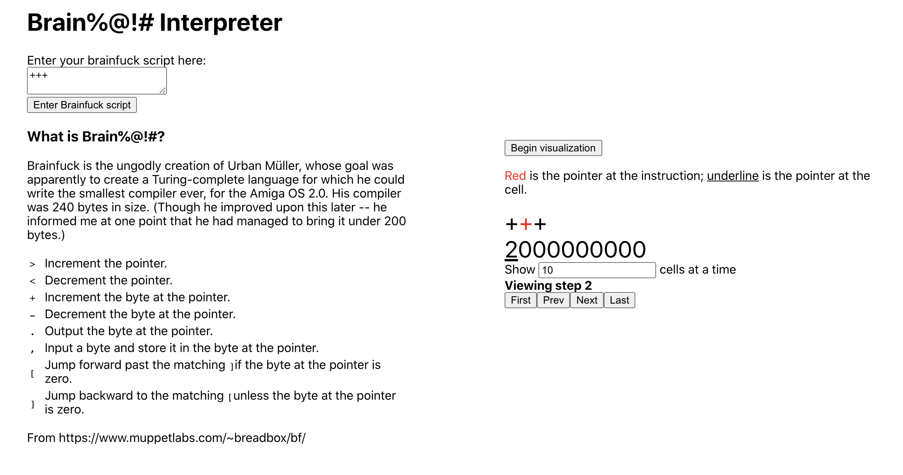

# Sym Full-Stack Challenge

Hello!  Here's my submission for this interview.

## Setup
1. Clone this repo
2. `cd brainfuck-backend` and `bundle install`
3. `rails server` to start the server
4. Be sure to go to `http://localhost:4000` for the rails server!
5.  Then `cd ../standalone-visualizer` and `npm install`
6. `npm start` to start the React server
7. Go to `http://localhost:3000` for the visualizer!
